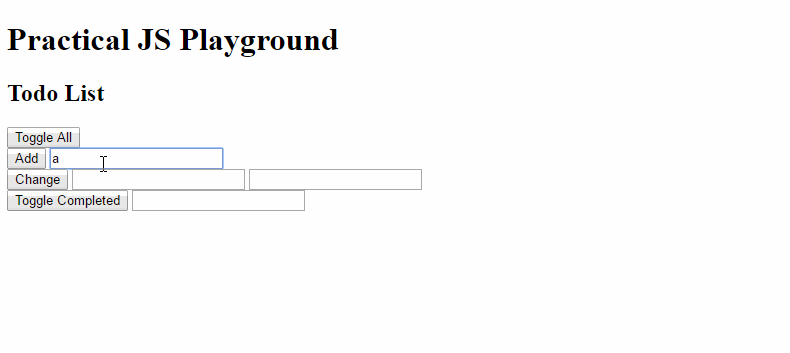

### Watch & Code.com: Practical JS Course by Gordon Zhu

I started this course in May 2016 and completed about 89% of it before getting distracted.

As part of my 52 Weeks of Creating initiative, I'm revisiting it and planning to complete it. During my first iteration of the project, I wrote all of my notes as JS files. This time around I will convert everything to Markdown so that I can reference the notes more easily.

I stored all my previous notes in the 2016 directory. My 2017 files are in the root of this repository.

Other notes:
Instead of using plnkr.co, I set up my own local environment for testing, creating an HTML file and linking each Javascript version of the app within that HTML file and then testing in Chrome. This is a GIF showing me using my app!

FYI - to create a blank new page in Chrome, just type `about:blank` in the URL bar, this is helpful for versions 1-3.

Things to further research include; MVC (Model View Controller)

_completed 3/23/2017_
